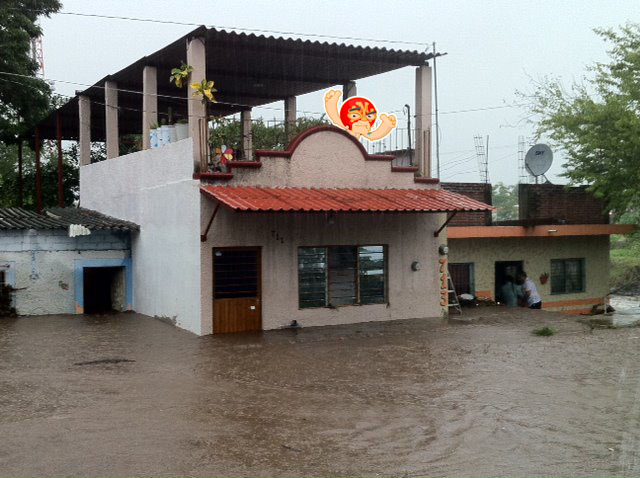

!SLIDE supersection

The Ruby Language

!SLIDE center

### Everything is an object
## Everything is an object
# Everything is an object
#**Everything is an object**

!SLIDE

# **Object** = state + behavior

!SLIDE center

!SLIDE bullet incremental center

* **Object**: A wrestler called Blue Demon
* **State**: Its color is blue
* **Behavior**: It wrestles

!SLIDE bullet incremental center

* **Object**: Instance of a class
* **State**: Instance variables
* **Behavior**: Methods

!SLIDE

    @@@ ruby
    object.behavior() # => It does something

!SLIDE

    @@@ ruby
    blue_demon.wrestle()

!SLIDE

    @@@ ruby
    object.state = 'value'

!SLIDE

    @@@ ruby
    blue_demon.color = 'blue'

!SLIDE

## **Functional vs Object-oriented**

PHP
    @@@ php
    strlen('string'); // 6

Ruby
    @@@ ruby
    'string'.length # => 6

!SLIDE

# Everything evaluates to *true* except *nil* or *false*

!SLIDE

    @@@ ruby
    zero = 0

    puts "It is true" if zero

!SLIDE

    @@@ ruby
    zero = 0

    puts "It is true" if zero

    # => "It is true"

!SLIDE

    @@@ ruby
    empty = ""

    puts "It's true" if empty

!SLIDE

    @@@ ruby
    empty = ""

    puts "It's true" if empty

    # => "It is true"

!SLIDE

    @@@ ruby
    false_value = false

    puts "It's false" unless false_value

!SLIDE

    @@@ ruby
    false_value = false

    puts "It's false" unless false_value

    # => "It's false"
!SLIDE

    @@@ ruby
    nil_value = nil

    puts "It's false" unless nil_value

!SLIDE

    @@@ ruby
    nil_value = nil

    puts "It's false" unless nil_value

    # => "It's false"

!SLIDE

    @@@ ruby
    zero = 0

    puts "It's false" unless zero

!SLIDE

    @@@ ruby
    zero = 0

    puts "It's false" unless zero

    # => nil

!SLIDE center

# Variables are
# **dynamically typed**

!SLIDE

    @@@ ruby
    value = 10

    value = "string"

!SLIDE

#NO PROBLEM

    @@@ ruby
    value = 10

    value = "string"

!SLIDE

# Data are
# **strongly typed**

!SLIDE small

    @@@ ruby
    "string" + 10

    TypeError: Can't convert Fixnum into String

!SLIDE

    @@@ ruby
    "string" + 10.to_s

!SLIDE

    @@@ ruby
    "string" + 10.to_s

    # => "string10"

!SLIDE

    @@@ ruby
    10 + "5"

!SLIDE

    @@@ ruby
    10 + "5"

    String can't be coerced into Fixnum

!SLIDE

    @@@ ruby
    10 + "5".to_i

!SLIDE

    @@@ ruby
    10 + "5".to_i

    # => 15

!SLIDE center

# Every method *returns* 
# the *last evaluation*

!SLIDE
    @@@ ruby
    def sum
        2 + 2
    end

!SLIDE
    @@@ ruby
    def sum
        2 + 2
    end

    result = sum

!SLIDE
    @@@ ruby
    def sum
        2 + 2
    end

    result = sum

    puts result

!SLIDE
    @@@ ruby
    def sum
        2 + 2
    end

    result = sum

    puts result

    # => 4

!SLIDE
    @@@ ruby
    def question?
      if true
          "Yes"
      else
          "No"
      end
    end

!SLIDE
    @@@ ruby
    def question?
      if true
          "Yes"
      else
          "No"
      end
    end

    result = question?

!SLIDE
    @@@ ruby
    def question?
      if true
          "Yes"
      else
          "No"
      end
    end

    result = question?

    puts result

    # => "Yes"

!SLIDE center

# Every expression
# evaluates to an object

!SLIDE

    @@@ ruby
    result = if true
                "Yes"
              else
                "No"
              end

!SLIDE
    @@@ ruby
    result = if true
                "Yes"
              else
                "No"
              end

    puts result

    # => "Yes"

!SLIDE

# Blocks
## code blocks

!SLIDE
    @@@ ruby
    do |param1, param2, ..., paramN|

      ...

    end

!SLIDE
    @@@ ruby
    { |param, param2, ..., paramN| ... }

!SLIDE

# Blocks are nameless functions

!SLIDE

## **Javascript example**
    @@@ javascript
    myFunc = function(param1, param2)
             {

               ...

             }

!SLIDE

## **Javascript example**
    @@@ javascript
    myFunc("arg1", "arg2")

!SLIDE
## **Javascript example**
    @@@ javascript
    function(param1, param2)
    {

      ...

    }

!SLIDE
## **Ruby block example**
    @@@ ruby
    { |arg1, arg2, ..., argN|

      ...

    }

!SLIDE center
# Most common usage for
# *blocks* is *loop abstraction*

!SLIDE
    @@@ ruby
    array.each do |element|

      # do something with the >element<

    end

!SLIDE center

# By default every method can
# receive a *block as argument*

!SLIDE
    @@@ ruby
    class MyClass

      def my_method

        yield 'param1_value' if block_given?

      end

    end

!SLIDE
    @@@ ruby
    my_class = MyClass.new

!SLIDE
    @@@ ruby
    my_class.my_method do |param1|

      param1

    end

!SLIDE
    @@@ ruby
    my_class.my_method do |param1|

      param1 # => 'param1_value'

    end

    yield 'param_value'

!SLIDE center

# *Exclamation* and
# *Question mark* methods

!SLIDE

# By convention 
# *exclamation mark* methods
# *replace the object*
# they are called on

!SLIDE

    @@@ ruby
    my_string = "lorem"

!SLIDE

    @@@ ruby
    my_string = "lorem"

    my_string.reverse # => "merol"

!SLIDE

    @@@ ruby
    my_string = "lorem"

    my_string.reverse # => "merol"

    my_string # => "lorem"

!SLIDE

    @@@ ruby
    my_string = "lorem"

    my_string.reverse! # => "merol"

!SLIDE

    @@@ ruby
    my_string = "lorem"

    my_string.reverse! # => "merol"

    my_string # => "merol"

!SLIDE

# By convention
# *question mark* methods
# return *true* or *false*

!SLIDE

    @@@ ruby
    5.zero? # => false

!SLIDE

    @@@ ruby
    7.odd? # => true

!SLIDE

    @@@ ruby
    [1,2,3,4].include? 1 # => true

!SLIDE

    @@@ ruby
    "Rails".start_with? "P" # => false

!SLIDE

# Parallel assignment

!SLIDE
    @@@ ruby
    a = 'string'

    b = 2

!SLIDE
    @@@ ruby
    a, b = b, a

!SLIDE
    @@@ ruby
    a # => 2

    b # => 'string'

!SLIDE
# The splat operator

!SLIDE
    @@@ ruby
    def my_method(*params)

      params

    end

!SLIDE
    @@@ ruby
    def my_method(*params)

      params

    end

    my_method 'arg1', 'arg2', 'arg3'

!SLIDE
    @@@ ruby
    def my_method(*params)

      params

    end

    my_method 'arg1', 'arg2', 'arg3'

    # => ['arg1', 'arg2', 'arg3']

!SLIDE
    @@@ ruby
    colors = ['red', 'green']

!SLIDE
    @@@ ruby
    colors = ['red', 'green']

    color1, color2 = *colors

!SLIDE
    @@@ ruby
    colors = ['red', 'green']

    color1, color2 = ['red', 'green']

!SLIDE
    @@@ ruby
    colors = ['red', 'green']

    color1, color2 = ['red', 'green']

    color1 # => 'red'

!SLIDE
    @@@ ruby
    colors = ['red', 'green']

    color1, color2 = ['red', 'green']

    color1 # => 'red'

    color2 # => 'green'

!SLIDE
# more on the splat operator
##<a href='http://bit.ly/raflabs_splat' target='_blank'>**http://bit.ly/raflabs_splat**</a>

!SLIDE
# Duck Typing

!SLIDE
# Implicit vs explicit cast

!SLIDE

# **Again...**

!SLIDE

# **Everything is an object**

!SLIDE

# *Objects are created based on* **blueprints**

!SLIDE

# *These blueprints are* **provided by classes**

!SLIDE

# **Every object is an *instance* of a *class***
